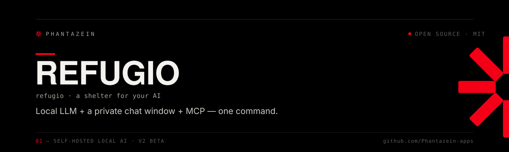

<div align="center">



<p>
  
  
  
  
  
</p>

**A self-hosted refuge for your AI — runs entirely on your own machine.**

<sub>Part of the <a href="https://phantazein.com">Phantazein</a> toolkit</sub>

</div>

---

<table>
<tr>
<td><a href="#install">📦 Install</a></td>
<td><a href="#local-llm-engine">🧠 LLM engine</a></td>
<td><a href="#connectors">🔌 Connectors</a></td>
<td><a href="#day-to-day-usage">⚡ Daily use</a></td>
<td><a href="#custom-domain">🌐 Domain</a></td>
</tr>
</table>

One command installs a **local LLM** (Ollama or LM Studio) and REFUGIO's own chat window, giving you a private, self-hosted AI assistant with no cloud, no API keys, and no data leaving your computer. Optional [Model Context Protocol](https://modelcontextprotocol.io/) connectors plug it into your **personal** tools — WhatsApp ([Hermeneia](https://github.com/Phantazein-apps/hermeneia)), email ([Epistole](https://github.com/Phantazein-apps/epistole)), Apple Reminders, Things 3, Notion, and persistent memory — and, if you want, **business** tools like Slack, Jira, ServiceNow, and Salesforce.

Works on **macOS, Linux, and Windows**. No prerequisites — the installer handles everything (Node.js, Git, the LLM engine, and the model).

> ## ⚠️ This is an early prototype
>
> **REFUGIO v2 is alpha.** The chat window, the settings page, web search and the
> native macOS window are all new and lightly exercised. Things will break and
> change, and some of them will break in ways nobody has seen yet.
> [Tell us what breaks](https://github.com/Phantazein-apps/refugio/issues) — that is
> what an alpha is for.
>
> The older Open WebUI build (v1.0.3) is still installable and is documented below, but
> it is **being retired** — new work goes into v2 only.

## Install

### macOS / Linux

```bash
curl -fsSL https://raw.githubusercontent.com/Phantazein-apps/refugio/main/install-refugio | bash
```

> **Deploying to a fleet?** There are `.pkg` and `.msi` builds designed for MDM
> — per-machine install, per-user runtime, silent, and configurable by
> configuration profile or Group Policy. See **[packaging/](packaging/)**, which
> also covers what signing costs and the one thing an installer genuinely
> cannot do (grant itself access to Notes and Messages).

### Windows (PowerShell)

```powershell
irm https://raw.githubusercontent.com/Phantazein-apps/refugio/main/install-refugio.ps1 | iex
```

This installs the **v2 alpha** — REFUGIO's own chat window. It replaces Open WebUI and talks to your connectors over MCP directly, instead of proxying them through MCPO:

- **No Python.** Open WebUI needs `uv`, a virtual environment, and loads PyTorch (~1–1.5 GB) just to boot. The built-in UI is Node and holds ~50 MB. That reclaimed memory is what lets an 8 GB machine run a model big enough to call tools.
- **A real window.** On macOS the menu-bar app opens REFUGIO in its own window — no browser, no address bar. Linux and Windows get tray icons.
- **Fewer moving parts.** MCPO exists only because Open WebUI can't speak MCP. The chat UI can, so it isn't started.
- **Sources.** Every answer built from your data can show exactly which tool calls produced it — which chats were read, which reminders listed.
- **Web search, off by default.** The one thing that leaves your machine. It has to be switched on, and then armed for each individual message, with a warning saying what is sent.
- **Discussion modes, also off by default.** Six built-in frames for one conversation — NVC, communication styles, career, life, a Spanish tutor, and reading your own WhatsApp history. They *remove* capability rather than adding it: no web search, no tools, no generated titles. See below.

### Known rough edges

Honest list, because this is an early prototype:

- The **Windows tray script has never been run on Windows**. It is written and its syntax checks, nothing more.
- The **native macOS window** is new and lightly exercised.
- If the **menu-bar icon doesn't appear**: check System Settings ▸ Control Center, where macOS 26 keeps a per-app list of which menu bar icons may show. `~/.refugio-logs/menubar.log` records the item's frame at launch. Note that on macOS 26 a healthy status item's window reports **no screen**, because Control Center hosts it in its own process — so that is not a sign of anything being wrong. `menubar/probe/build.sh` builds a 40-line menu-bar app that does nothing but show the word PROBE; if that appears and REFUGIO doesn't, the difference is in REFUGIO.
- **Small models are weak at choosing tools.** REFUGIO refuses to install one that can't call tools at all, but a 3B model still picks wrong sometimes.
- Sources are kept **for the session only** — reopening a conversation shows the answers, not the raw tool output behind them.

A fuller register — including what the `.pkg` and `.msi` do *not* set up, and what the chat UI spec planned and never built — is in [`docs/gaps.md`](docs/gaps.md).

### Open WebUI (legacy, being retired)

Open WebUI was REFUGIO's interface through v1. It still works and is still installable, but it is on its way out — it needs `uv`, a Python virtual environment and PyTorch (~1–1.5 GB of RAM) just to start, and it can't speak MCP, which is the only reason MCPO exists in this project at all.

```bash
# The last Open WebUI release
REFUGIO_VERSION=v1.0.3 curl -fsSL https://raw.githubusercontent.com/Phantazein-apps/refugio/main/install-refugio | bash

# Or add it to a v2 install — it is not installed unless you ask
curl -fsSL https://raw.githubusercontent.com/Phantazein-apps/refugio/main/install-refugio | bash -s -- --owui
```

Only that path installs `uv`, the Python virtual environment and PyTorch, and only that path asks you for an account — the chat window binds to loopback and has no logins.

`REFUGIO_CHAT=0` hands the connectors back to Open WebUI, since only one of the two can own them.

### What happens

1. Installs **Node.js** and **Git** if missing (plus **[uv](https://docs.astral.sh/uv/)** only if you asked for Open WebUI)
2. Clones REFUGIO to `~/refugio`
3. Auto-installs **[Ollama](https://ollama.com/)** and pulls a model sized to your machine's RAM (or connects to **[LM Studio](https://lmstudio.ai/)** if you set `REFUGIO_ENGINE=lmstudio`)
4. Downloads what connectors need to exist at all — the **WhatsApp bridge**, **email**, a **memory backend**, and **business** tools (Slack, Jira, ServiceNow, Salesforce) if you opt in. Which connectors are actually switched on is asked in the window, not here
5. Sets up **https://refugio** as a local domain (mkcert + Caddy — asks for your admin password once)
6. Starts everything and opens REFUGIO — a native window on macOS, your browser elsewhere — on **first run, at the setup screen**

> **Reinstalling?** Run the same command again. Your settings in `~/.refugio.env` are preserved.

### Uninstalling

```bash
~/refugio/uninstall-refugio              # asks before deleting anything expensive
~/refugio/uninstall-refugio --dry-run    # show what would go, change nothing
~/refugio/uninstall-refugio --all        # everything, no questions
```

Deleting `~/refugio` by hand is not the same thing: your **chat history lives inside it** (`~/refugio/data`), and your **WhatsApp link lives in `~/hermeneia`** — losing that means scanning the QR code again. The uninstaller asks about both, and about your Ollama models, before touching them. Everything else — the app, the login item, the tray, the `refugio` command — goes without asking, because a reinstall recreates it.

### After install

On machines with comfortable RAM, REFUGIO **auto-starts on login**. On **low-RAM (≤ 8 GB)** machines it runs **on demand** instead — so it never holds memory when you're not using it (start with `refugio`, stop with `refugio stop`).

1. Open REFUGIO — the **menu-bar app** on macOS (or its Dock icon), the **tray icon** on Linux and Windows, or **http://127.0.0.1:8090** in any browser
2. Start chatting — your local model is ready
3. Open **Settings** to see your connectors, fix a broken one, choose how much each may read, switch or download models, and turn web search on

### First run

The first time REFUGIO opens it shows a short setup — welcome, model, connectors,
web search, done — instead of the terminal asking those questions while you are
still watching an installer scroll past. Everything in it is optional and
everything in it is in **Settings** afterwards; "Skip setup" is on the first
screen and is remembered.

It is also the only way to configure a connector on a machine installed by MDM,
where the terminal installer never runs at all.

Two things still live in the terminal, because their setup is a live round trip
that hasn't moved yet: **linking WhatsApp** (scan a code with your phone) and
**email**. Both are reachable from Settings ▸ Connectors, which opens the same
QR page the installer used to.

Connectors switched on during setup are written to `~/.refugio.env`, which the
supervisor reads **when it starts** — so they are saved but not running until
you `refugio restart`. Setup says so rather than claiming they are connected.

### Settings

Everything that used to be a terminal prompt is a page now: **http://127.0.0.1:8090/settings**, the link in the chat window's top bar, the status pill, or ⌘, from the menu-bar app.

| Page | What it answers |
|---|---|
| **Connectors** | Which of your local programs are working, and what to do about the ones that aren't. Each connector states its condition once — ready, connecting, degraded, or failed. A failure names the thing that refused and what wasn't read, with the connector's own output quoted verbatim beside it; where REFUGIO can't explain the output it shows the quotation alone rather than inventing a cause. Scope options ("today's reminders only") appear only on connectors that work, because *off* must always mean narrower. |
| **Models** | What's installed, what's selected, and what fits in the memory free right now. A model that can't call tools is marked as such — that failure is otherwise invisible, because the model answers fluently and simply never reads your data. Downloads run from here, and **Check for better models** asks two questions at once: Ollama, about every model already installed (no network), and this repository's [`models.json`](models.json), for models rated after your copy was released — so a newer, lighter model can reach you without updating REFUGIO. The catalog fetch is one GET for one public file, sends nothing about your machine, and obeys the same switch as update checks. |
| **Web search** | The one thing in REFUGIO that leaves your machine. Off by default, and switching it on still doesn't start searching — each message has to be armed on its own, in the chat, with the warning shown at the time. |
| **Discussion modes** | Which coaching modes are offered in the chat, and what each one is and is not. Every one is off until you switch it on, and nothing appears in the composer until something is on. |
| **Appearance** | Light, dark, or follow the system — which is the default, and switches with your Mac as it does. Plus text size and motion. |
| **Updates** | Whether a newer REFUGIO exists, and the command to apply it. The second thing here that reaches the network — see below. |
| **Data & reset** | How many conversations exist, how many files you've attached and what they weigh, where both live on disk, and an erase that requires typing the word `delete`. Nothing is synced anywhere, so that file is the only copy. |

### Discussion modes

A mode is a named frame around **one conversation**: a system prompt, a set of guardrails, and a smaller set of capabilities. You switch one on in **Settings ▸ Discussion modes**, then pick it in the composer *before the first message*. After that it is fixed — the system prompt is rebuilt on every turn, so changing it mid-thread would silently reframe everything already said. Leaving a mode means starting a new chat, and there is a **Leave** button that says so.

| Mode | What it is for |
|---|---|
| **NVC Coach** | Nonviolent Communication. Think a situation through, or get a message reworded into observation, feeling, need and a request the other person can refuse. |
| **Style Coach** | Communication styles (Merrill-Reid, 1981): how you come across, what you do under pressure, and how to reach one difficult person. |
| **Career Coach** | Interview practice, negotiation wording, and decisions with their costs. No internet, so any number is one to check. |
| **Life Coach** | One step small enough that you will do it, with the day and the place. Stops proposing steps when what you wanted was to be heard. |
| **Spanish Tutor** | Conversation in Spanish at your level, corrected as you go, with a register switch (tú / usted) and drills on request. |
| **Chat with WhatsApp** | Search, summarize and discuss your own message history. Read-only, and needs the WhatsApp connector. |

**What a mode takes away.** Web search is refused on a mode turn in two places, not hidden in one: the composer drops the arming button, the server forces it off, and the tool is refused again at the point it would run. A coaching mode is handed **no tools at all** — including memory, whose whole job is to persist and, in its GitHub-backed variant, upload what was said. And the sidebar title comes from the mode, not from what you typed: `NVC coaching — Aug 24`, never a summary of the thing you came here to say quietly.

**Two modes may read, and only read.** NVC Coach can be opened as *NVC Coach + WhatsApp* when that connector is working, and the data mode reads it directly. Both are limited to `list_chats`, `list_messages` and `search_contacts` — the tool that sends a WhatsApp message is on the connector and in no mode's list, and a model that names it anyway is refused with an error it can read. Anything you want sent, you copy out and send yourself.

**Safety, and what is prompt versus what is enforced.** Every coaching mode carries the same crisis text, and the copy in it was rewritten from measurements rather than written from intent. But prompt text is advisory: when your own words carry a signal and the reply did not already point at real help, **REFUGIO adds crisis resources itself**, in a separate box labelled *"From REFUGIO, not the model"* — because the floor exists precisely for the case where the model got it wrong, and a phone number should not inherit the model's authorship.

**Each mode says which model size it was measured on.** All of them recommend an 8B model or larger, and each says why in its own terms — for NVC it is whether the safety wording holds; for the WhatsApp modes it is whether the model can form a tool call at all; for the Spanish Tutor it is that a smaller model will hand your own mistake back to you as the correction. On a smaller model the picker and Settings say so rather than implying every model behaves the same.

**No mode remembers anything across conversations.** Within one conversation history is never truncated, so an assessment or a correction holds for as long as that chat does. Come back tomorrow and nothing was kept — the modes that would obviously want it (Style Coach, the tutor) say so in their own copy rather than letting you discover it by being asked the same questions again.

On a machine deployed by MDM an administrator can narrow which modes may be switched on at all — see `allowedModes` in [`packaging/README.md`](packaging/README.md). Policy can only ever narrow: there is no setting that switches a mode on for someone.

How the modes are built, what is enforced in code rather than asked for in a prompt, and what the red-team runs actually measured — including what is known *not* to work on a small model — is in [`docs/discussion-modes.md`](docs/discussion-modes.md).

### Attaching files

Click the paperclip, drag a file onto the window, or paste one. Up to five per message; a file on its own, with nothing typed, is a message.

Text files — notes, CSVs, code, configuration, Markdown — are read and sent to the model along with your question, up to 20,000 characters each. Past that the model is told plainly where it was cut off, so it can say the answer might be further in rather than answering from half a document.

**Formats REFUGIO cannot read say so — on the chip, and in the prompt.** A PDF is mostly binary, a `.docx` is a zip, and an image is an image; a local model like `llama3.1:8b` cannot see any of them. Attaching one gives the model the file's name, size and path, plus an explicit instruction not to guess at the contents. That instruction is the whole point: handed nothing but the name `lease.pdf`, a small model will confidently describe a lease.

A note on what *attached* means here. Browsers refuse to tell a web page where a chosen file lives — `input.value` is `C:\fakepath\lease.pdf` in every engine, on purpose — so REFUGIO takes the bytes over loopback, writes its own copy under `~/.refugio-data/attachments/`, and hands the model *that* path, which is real and opens in Finder. Nothing leaves the machine either way. Removing a chip before sending deletes the copy; copies whose message was never sent are swept a day later; **Data & reset** erases the rest.

### Updates

REFUGIO checks whether the release branch it was installed from has moved, at most **once a day** and never in the first minute after launch. If it has, a line appears above the chat and a dot appears on Settings ▸ Updates. Dismissing the line is remembered against that specific commit, so it stays gone until there is a genuinely different update.

**What a check sends:** one `git ls-remote` to github.com, asking what commit a public branch points at. No data of yours goes with it — not your messages, not your version, not an identifier. GitHub learns that an IP address asked. It is off in one click in Settings ▸ Updates, and off means REFUGIO makes no update requests at all, including the manual "Check now".

**REFUGIO does not update itself.** Applying an update means a code update, a rebuild of the menu-bar app and a restart of the supervisor — and the chat server is a child of that supervisor, so a self-update would be killing itself half way through, with no working surface left to report a failure in. The page shows the command instead:

```
cd ~/refugio && git pull --ff-only && ./menubar/install.sh && refugio restart
```

If you pick a model that can't call tools, the chat holds the message rather than answering: it would reply from general knowledge and quietly invent the contents of your own data. It offers the installed models that can, and an explicit way through if you meant it.

## Local LLM engine

REFUGIO runs the model **on your machine** — nothing is sent to any external service.

- **Ollama** (default) is installed automatically and a model is pulled for you. The installer doesn't ask — this is what almost everyone wants, and it's the one REFUGIO can install and manage for you.
- **LM Studio** — for people already running it. Set `REFUGIO_ENGINE=lmstudio` and REFUGIO connects to its local server (OpenAI-compatible on `http://localhost:1234`) instead of installing Ollama. Start the server first: LM Studio → Developer → Start Server.
- **Neither** — `REFUGIO_ENGINE=none` skips the engine entirely, for setting one up by hand later.

Your choice is remembered in `~/.refugio.env`, so reinstalling never moves you off the engine you picked.

### Model auto-selection

**Minimum: 8 GB RAM.** REFUGIO connects a local AI to your own data — messages, calendar, notes — and that requires a model that can *call tools*. The smallest one that reliably can is `qwen2.5:3b` (~2.6 GB). Smaller models fit on less hardware and hold a perfectly good conversation, but they can't reach your data, which is the whole point. On a machine that can't run the floor model the installer says so and stops rather than leaving you with a chat window whose connectors silently do nothing.

The installer picks a model sized to your system memory. **Every tier below can call tools** — that is the entry requirement, not a feature of the larger ones:

| System RAM | Default model | Approx. download |
|------------|---------------|------------------|
| ≤ 10 GB | `qwen2.5:3b` | ~1.9 GB |
| 11–16 GB | `llama3.2:3b` | ~2 GB |
| 17–32 GB | `llama3.1:8b` | ~4.7 GB |
| 33–48 GB | `qwen2.5:14b` | ~9 GB |
| > 48 GB | `gpt-oss:20b` | ~13 GB |

Sizes account for macOS + your other apps, not just total RAM. On **≤ 8 GB** machines REFUGIO also unloads the model shortly after you stop chatting (so it doesn't hold RAM hostage between messages).

**Two tiers, auto-switched.** The table above is the **optimal** model (sized to total RAM). On larger machines the installer also downloads a lighter **companion** one tier down — e.g. `llama3.1:8b` + `llama3.2:3b` on a 32 GB Mac. Every time REFUGIO starts it measures how much RAM is actually **free** (after your other apps load) and **activates whichever installed model fits right now**. The companion never drops below the tool-calling floor: if free RAM is tight REFUGIO runs the floor model tight and tells you to close some apps, rather than quietly switching to a model that can't use your connectors.

In the model picker each model is labelled for your *current* free RAM — the active one shows **✓**, and one that needs more RAM than is free shows **⚠ needs ~N GB free** plus a warning in its description, so manually switching to a too-heavy model is an informed choice.

> On Apple Silicon, make sure Ollama is the **arm64** build — an x86_64/Rosetta Ollama runs CPU-only (no Metal GPU) and is far too slow for any but the smallest models.

Pull more models any time with `ollama pull <model>`, then pick them in the model selector. To override the default at install time, set `REFUGIO_MODEL` (e.g. `REFUGIO_MODEL=llama3.1:8b`).

## Connectors

All connectors are **optional** — configure only the ones you want, or none at all. They come in two groups: **personal** (offered first in the installer) and **business** (behind a single opt-in prompt). The chat window talks to them over **MCP directly**. (On the legacy Open WebUI path they go through [MCPO](https://github.com/open-webui/mcpo), an MCP-to-OpenAPI proxy, because Open WebUI cannot speak MCP.)

### Personal connectors

| Connector | How it runs | Tools |
|-----------|-------------|-------|
| **WhatsApp** ([Hermeneia](https://github.com/Phantazein-apps/hermeneia)) | local, stdio (MCP) | `list_messages`, `list_chats`, `search_contacts`, `send_message`, media, multi-account — 17 tools |
| **Email** ([Epistole](https://github.com/Phantazein-apps/epistole)) | your own Cloudflare Worker, via [mcp-remote](https://github.com/geelen/mcp-remote) | `read_inbox`, `search_messages`, `semantic_search`, `send_message`, `reply_to_message` — 19 tools |
| **Apple Reminders** ([just-claude-reminders](https://github.com/Phantazein-apps/just-claude-reminders)) | bundled with REFUGIO, stdio (MCP) | `reminders_get_reminders`, `reminders_create_reminder`, `reminders_complete_reminder` — 7 tools |
| **Things 3** ([just-claude-things](https://github.com/Phantazein-apps/just-claude-things)) | bundled with REFUGIO, stdio (MCP) | `things3_get_todos`, `things3_create_todo`, `things3_complete_todo` — 10 tools |
| **Apple Notes** | in-repo (`servers/notes.js`), stdio (MCP) | `notes_search`, `notes_search_text`, `notes_recent`, `notes_read`, `notes_folders`, `notes_create` — 6 tools |
| **Notion** | local server, port 3002 | `search`, `get_page`, `get_block_children`, `query_database` |
| **Memory** | local server, port 3004 | see below |

#### WhatsApp (Hermeneia)

WhatsApp is REFUGIO's flagship connector — for many people it's the main reason to run REFUGIO at all. It works on **macOS (Apple Silicon or Intel), Linux (x64/arm64), and Windows** — so it runs on the same headless Linux box as the rest of your REFUGIO stack. The installer clones [Hermeneia](https://github.com/Phantazein-apps/hermeneia) to `~/hermeneia`, fetches the prebuilt bridge binary for your platform from Hermeneia's latest release, and walks you through the **built-in auth step**: a QR page opens (on a headless/remote host it prints the URL — `http://127.0.0.1:3456/setup` — so you can open it over an SSH tunnel), and on your phone you go to **WhatsApp → Settings → Linked Devices → Link a Device** and scan it. The link survives restarts, and your messages stay in a local database on your machine. If you skip the scan during install, the QR page opens again the first time REFUGIO starts.

Already linked before and it stopped working? WhatsApp can revoke a linked device server-side (or you removed the **"Claude"** device on your phone) without anything on disk changing — so re-run the installer and choose **re-link** when it offers, or ask your assistant to "check my WhatsApp status" for a fresh QR.

Already have your own Hermeneia checkout? Point `HERMENEIA_DIR` at it in `~/.refugio.env`. (If it has no `dist/hermeneia-bridge*` binary, build it with `npm run build` — needs Go 1.21+ — or let the installer fetch the prebuilt.)

> **Also using Hermeneia in Claude Desktop?** Both share the same data directory, and Hermeneia enforces a single running instance per data directory — whichever app starts it first holds the WhatsApp connection, and the other's copy exits quietly. Quit the Claude app before starting REFUGIO (or vice versa) if you want to switch.

#### Email (Epistole)

[Epistole](https://github.com/Phantazein-apps/epistole) is a remote MCP server you deploy to **your own Cloudflare account** (free tier; a separate ~30-minute setup — see its README). Once deployed, give the installer its URL: it runs the one-time OAuth flow in your browser (Epistole emails you a code), caches the tokens locally, and from then on REFUGIO connects headlessly via `mcp-remote`.

#### Apple Reminders & Things 3

Both ship **bundled with REFUGIO** as npm dependencies ([just-claude-reminders](https://github.com/Phantazein-apps/just-claude-reminders), [just-claude-things](https://github.com/Phantazein-apps/just-claude-things)) — no credentials, no extra install; the installer just asks whether to enable them (`REFUGIO_REMINDERS=1` / `REFUGIO_THINGS=1` in `~/.refugio.env`). macOS only: they drive the apps via JXA/AppleScript, so the **first tool call** triggers the standard macOS Automation permission prompt (System Settings → Privacy & Security → Automation). Things 3 additionally requires [the app](https://culturedcode.com/things/) to be installed — the installer skips it if it isn't.

#### Apple Notes

Reads and searches your notes and can create new ones. **It never edits, moves or deletes an existing note** — there is no tool that can, deliberately: a model misreading "clear my notes about the flat" would otherwise be able to act on it, and a note lost that way has no undo and no copy.

macOS only, and enabled by the installer (`REFUGIO_NOTES=1` in `~/.refugio.env`). Like Reminders and Things 3, it drives Notes.app through JXA, so the **first tool call raises the standard macOS Automation prompt**.

It talks to Notes.app rather than reading `NoteStore.sqlite` directly. The database is much faster, and wrong twice over: note bodies are gzipped protobuf blobs in an undocumented format that changes between releases — getting it subtly wrong means silently returning truncated notes — and the container is TCC-protected, so reading it needs **Full Disk Access**, a far broader grant than this connector deserves.

Two scope options in Settings ▸ Connectors, both of which remove a tool rather than filter its results:

| Option | What it does |
|---|---|
| **Search titles only** | Removes `notes_search_text`. Full-text search has to open every note it scans, so filtering afterwards would be enforcing a rule after breaking it. Opening a note you named still works. |
| **Never create notes** | Removes `notes_create`, the only tool that writes anything. |

Full-text search stops at a cap (400 notes by default, `REFUGIO_NOTES_SCAN_CAP`) because Notes offers no way to filter on body text. When it stops early it **says so** rather than reporting "no matches" — those are different facts and the second one is a lie.

### Business connectors

For workplace use cases — the installer only prompts for these if you opt in.

| Server | Port | Tools |
|--------|------|-------|
| **Slack** | 3001 | `search_messages`, `get_channel_history`, `list_channels`, `get_thread` |
| **Jira** | 3003 | `search_issues`, `get_issue`, `get_projects` |
| **ServiceNow** | 3005 | `query_table`, `get_record`, `list_tables` |
| **Salesforce** | 3007 | `soql_query`, `get_record`, `search`, `describe_object`, `list_objects` |

### Memory

Memory scales to your RAM:

- **16 GB+ → [MemPalace](https://github.com/MemPalace/mempalace)** (default) — local-first semantic memory (ChromaDB + a local embedding model); nothing leaves your machine. Exposed through a lean 2-tool wrapper (`memory_search` / `memory_save`) so small models aren't flooded with its 33 tools.
- **≤ 8 GB → GitHub-backed (PACK-style)** — MemPalace's embeddings (~1.5 GB) are too heavy alongside the model here, so the lightweight backend is offered instead: a markdown memory doc synced to a private GitHub repo via the bundled `servers/memory.js` (`get` / `update`), **no local embeddings (~0 RAM)**. Needs a fine-grained PAT with Contents read/write — or choose **None** for model-only.

## Day-to-Day Usage

**Comfortable RAM (> 8 GB):** REFUGIO auto-starts on login. To start it manually:

```bash
node ~/refugio/start-refugio.cjs   # or: cd ~/refugio && npm start
```

**Low RAM (≤ 8 GB):** REFUGIO runs **on demand** so it doesn't hold ~0.6 GB all day. (The model itself is always loaded lazily on the first chat and unloaded shortly after — startup never loads a model — so idle cost is just the chat server at ~50 MB — or Open WebUI's ~1 GB if you are still on that path.)

```bash
refugio          # start it (opens the browser)
refugio stop     # stop everything and free the RAM
refugio status   # is it running?
# or double-click "Start REFUGIO.command" (macOS) / "Start-REFUGIO.bat" (Windows)
```

To reconfigure or update, run the installer again.

### Menu-bar app (macOS)

A tiny native menu-bar app gives non-technical users a one-click **Start / Stop / Open** control, a **Launch at Login** toggle, and **Quit** — no terminal needed. It just drives the existing `~/refugio` supervisor (quitting the app does *not* stop REFUGIO; use **Stop**).

```bash
cd ~/refugio/menubar && ./install.sh      # builds REFUGIO.app → /Applications, launches it
```

Requires the Swift toolchain (`xcode-select --install`). Look for REFUGIO's mark — three walls open at the bottom — in the menu bar.

**Auto-start details (> 8 GB):**
- **macOS**: launchd (`~/Library/LaunchAgents/com.phantazein.refugio.plist`)
- **Linux**: systemd user service (`~/.config/systemd/user/refugio.service`)
- **Windows**: Startup folder (`REFUGIO.vbs`)
- **Logs**: `~/.refugio-logs/refugio.log` and `~/.refugio-logs/refugio.err`

## Custom Domain

The installer sets up **https://refugio** for you — no question asked, because every part of it can be attempted and every failure falls back to something that works.

- Uses [mkcert](https://github.com/FiloSottile/mkcert) for locally-trusted TLS + [Caddy](https://caddyserver.com/) as a reverse proxy
- Asks for your admin password once, for the certificate and the `/etc/hosts` entry
- Restored automatically on reinstall
- If any of it fails, REFUGIO stays reachable at **http://127.0.0.1:8090** — the domain is a shortcut, never a dependency
- `REFUGIO_DOMAIN=0` skips it, for a headless box or anyone who'd rather not have a hosts entry

Open WebUI, if you installed it, keeps **:8080**.

## How It Works

### Installer chain

```
curl | bash
  → install-refugio (bash)    Installs Node.js + Git
  → install-node.cjs (node)   Clones the repo, sets up the LLM engine,
                              credentials, and starts everything
  → configure-owui.cjs        Legacy: configures Open WebUI when that path is chosen
```

### Architecture

```
Native window / browser → REFUGIO chat (:8090) ─┬─→ Ollama / LM Studio (local model)
                                                 └─→ MCP servers (stdio + :3001–3007) → APIs

Legacy: Browser → https://refugio (Caddy) → Open WebUI (:8080) → MCPO (:8010) → the same MCP servers
                                                                           ├─→ Hermeneia (stdio) → WhatsApp
                                                                           ├─→ Reminders / Things 3 (stdio → JXA)
                                                                           └─→ mcp-remote (stdio) → Epistole (your Worker)
```

- **Everything runs locally.** The model, the UI, and the connector servers all run on your machine.
- **The chat UI** is plain Node with no dependencies beyond what REFUGIO already installs. **Open WebUI**, on the legacy path, runs natively (no Docker) in a `uv`-managed Python virtual environment.
- **MCP servers** run as detached Node.js processes, supervised by `start-refugio.cjs` (auto-restarted on crash). WhatsApp and email are stdio servers, spawned by whichever surface owns the connectors — the chat UI, or MCPO on the legacy path.
- **Credentials** are stored in `~/.refugio.env` (chmod 600).
- **System prompt** is auto-generated from the connectors you enabled.

## Manual Setup

### 1. Clone and install

```bash
git clone https://github.com/Phantazein-apps/refugio.git ~/refugio
cd ~/refugio
npm install
```

### 2. Configure credentials

Create `~/.refugio.env` (or run the installer, which writes it for you):

```bash
# -- LLM Engine --
REFUGIO_ENGINE=ollama
OLLAMA_BASE_URL=http://localhost:11434
REFUGIO_MODEL=llama3.1:8b
# For LM Studio instead:
# REFUGIO_ENGINE=lmstudio
# OPENAI_API_BASE_URL=http://localhost:1234/v1
# OPENAI_API_KEY=lm-studio

# -- Your Account --
OWUI_NAME=
OWUI_EMAIL=

# -- WhatsApp (Hermeneia) — path to a checkout with a built dist/ --
HERMENEIA_DIR=/Users/you/hermeneia

# -- Email (Epistole) — base URL of your deployed Worker --
EPISTOLE_URL=https://mail.yourdomain.com

# -- Apple Reminders / Things 3 (macOS, bundled — set to 1 to enable) --
REFUGIO_REMINDERS=1
REFUGIO_THINGS=1

# -- Notion --
NOTION_TOKEN=ntn_...

# -- Memory --
# MemPalace (local): REFUGIO_MEMORY=mempalace
# GitHub-backed:     REFUGIO_MEMORY=github + the GITHUB_* values below
REFUGIO_MEMORY=mempalace
GITHUB_TOKEN=
GITHUB_OWNER=
GITHUB_REPO=
GITHUB_MEMORY_PATH=MEMORY.md

# -- Slack (user token required for search) --
SLACK_TOKEN=xoxp-...

# -- Jira --
JIRA_DOMAIN=yourcompany.atlassian.net
JIRA_EMAIL=you@yourcompany.com
JIRA_API_TOKEN=...

# -- ServiceNow --
SERVICENOW_INSTANCE=yourcompany.service-now.com
SERVICENOW_USERNAME=your.username
SERVICENOW_PASSWORD=...

# -- Salesforce --
SALESFORCE_INSTANCE_URL=https://yourcompany.my.salesforce.com
SALESFORCE_USERNAME=your.username
SALESFORCE_PASSWORD=...
SALESFORCE_SECURITY_TOKEN=...
```

### 3. Start servers individually

```bash
cd ~/refugio
node servers/slack.js --http            # port 3001
node servers/notion.js --http           # port 3002
node servers/jira.js --http             # port 3003
node servers/memory.js --http           # port 3004 (GitHub-backed memory)
node servers/servicenow.js --http       # port 3005
node servers/salesforce.js --http       # port 3007
```

Override the port: `MCP_SSE_PORT=4000 node servers/slack.js --http`
Verify a server: `curl http://localhost:3001/health`

WhatsApp (Hermeneia), email (Epistole), Apple Reminders, and Things 3 have no local ports of their own — the supervisor writes them into `mcpo-config.json` as stdio entries and whichever surface owns the connectors spawns them (`node $HERMENEIA_DIR/dist/index.js`, `mcp-remote $EPISTOLE_URL/mcp`, and the bundled `node_modules/{reminders-mcp,just-claude-things}/dist/index.js`).

## Server Modes

All servers support three transports:

| Mode | Flag | Use Case |
|------|------|----------|
| Streamable HTTP | `--http` | Most MCP clients (and Open WebUI, on the legacy path) |
| SSE | `--sse-only` | Legacy MCP clients |
| stdio | *(none)* | Claude Desktop and other stdio-based MCP clients |

## Project Structure

```
├── install-refugio            # Bash bootstrap (installs Node + Git, runs installer)
├── install-refugio.ps1        # PowerShell bootstrap for Windows
├── install-node.cjs           # Main installer (cross-platform): LLM engine, chat UI, connectors
├── start-refugio.cjs          # Process supervisor (LLM, chat UI, MCP servers, Caddy)
├── scripts/
│   ├── configure-owui.cjs     # Legacy: auto-configures Open WebUI (account, prompt, tools)
│   └── google-auth.js         # One-time Google OAuth2 setup (optional memory sync)
├── server.js                  # All-in-one MCP server (all tools on one port)
├── servers/
│   ├── shared.js              # Shared transport, startup, and error handling
│   ├── slack.js               # Slack MCP server
│   ├── notion.js              # Notion MCP server
│   ├── jira.js                # Jira MCP server
│   ├── memory.js              # GitHub-backed memory MCP server
│   ├── servicenow.js          # ServiceNow MCP server
│   └── salesforce.js          # Salesforce MCP server
├── connectors/                # API connectors used by the servers
├── branding/                  # REFUGIO logo and icon assets
└── package.json
```

## Built With

100% vibe coded with [Claude](https://claude.ai/).

## License

MIT

---

<div align="center">
<sub>Built by <a href="https://phantazein.com">Phantazein</a> · <a href="https://github.com/Phantazein-apps">more tools →</a></sub>
</div>
